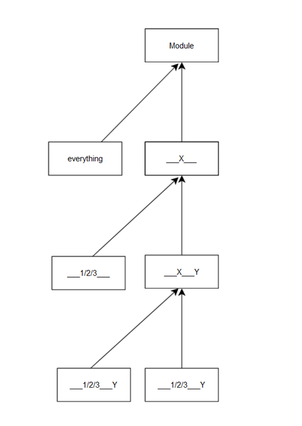

# 核心流程设计分析

## 神经网络的创建

此前我们已经通过了一个简单的用例大致了解了pytorch构建神经网络的流程，现在我们来详细分析一下。

一般在进行此类分析时，使用UML类图和时序图会是一个不错的选择，但在对于pytorch这种库的分析中，这两种图表的作用并不是很大。因为如果硬要画出这两种图。会发现给出的会是类似下图的结果




解释一下上面的两幅图：

- 第一幅时序图描述的是在Sequential类中添加一个Conv2d层的过程，然而这个过程几乎可以直接用语言表示：先层层调用各类的__init__方法，得到一个Conv2d对象，再调用基类的add_module方法，将这个对象添加到Sequential对象的modules列表中。并且这一图表既可以用来描述创建时的过程，也可以几乎不做任何修改的用于训练或推理时的forward/backward过程。

- 第二幅图是一个UML类图，这一类图几乎可以解释torch.nn中的所有类，即要么直接继承自Module，要么是几个只有微量区别的类继承到共同的父类，再继承到Module。（例如Conv2d继承自ConvNd，再继承自Module）

所以对创建神经网络流程的分析，几乎可以等同于对torch.nn.Module类的分析。

## Module类的分析

Module类是pytorch中所有神经网络模型的基类，它定义了神经网络模型的基本结构，包括了模型的初始化、前向传播、反向传播等方法。对于卷积层、全连接层等模型，他们的区别在于foraward等方法的具体实现不同，而这一点我们并不需要关心。

Module类的相关方法主要有以下几种：

- 基础的方法：如 `__init__`

- 为加载模型参数的方法：如 `load_state_dict`、`state_dict`

- 训练用的方法：如 `train`、`eval`、`zero_grad`

- hook机制有关的方法：如 `register_forward_hook`、`register_backward_hook`，这一点会在后面的章节中详细介绍

至于具体使用的`forward`等方法，则是在子类中实现的。如果是在java中，这一点或许会被设计为接口或者抽象类，但因为python的动态特性，这一点并不是必须的。

### 模型的初始化

Module类的初始化方法主要来自于`__init__`,这一方法

```python
    def __init__(self, *args, **kwargs) -> None:
        """Initialize internal Module state, shared by both nn.Module and ScriptModule."""
        torch._C._log_api_usage_once("python.nn_module")

        # 省略参数检查代码
        

        """
        Calls super().__setattr__('a', a) instead of the typical self.a = a
        to avoid Module.__setattr__ overhead. Module's __setattr__ has special
        handling for parameters, submodules, and buffers but simply calls into
        super().__setattr__ for all other attributes.
        """
        super().__setattr__("training", True)
        #省略部分参数设置

        if self.call_super_init:
            super().__init__(*args, **kwargs)

```

这里调用`__setattr__`而不是直接对属性赋值，主要是出于性能考虑。

而对于多个层的模型，我们可以通过`add_module`方法来添加层

```python

    def add_module(self, name: str, module: Optional["Module"]) -> None:
        r"""Add a child module to the current module.

        The module can be accessed as an attribute using the given name.

        Args:
            name (str): name of the child module. The child module can be
                accessed from this module using the given name
            module (Module): child module to be added to the module.
        """
        # 省略参数检查代码

        for hook in _global_module_registration_hooks.values():
            output = hook(self, name, module)
            if output is not None:
                module = output
        self._modules[name] = module
```

`_modules`属性里便存储了所有的子模块。

### 模型的使用：像函数一样调用

为了使模型能像函数一样调用，Module类还实现了`__call__`方法，这一方法会调用`_wrapped_call_impl`方法。这是一个装饰器，包装了具体的方法，并根据编译与否选择不同的具体调用

```python
    __call__: Callable[..., Any] = _wrapped_call_impl
```

```python
def _wrapped_call_impl(self, *args, **kwargs):
    if self._compiled_call_impl is not None:
        return self._compiled_call_impl(*args, **kwargs)  # type: ignore[misc]
    else:
        return self._call_impl(*args, **kwargs)

# torchrec tests the code consistency with the following code
# fmt: off
def _call_impl(self, *args, **kwargs):
    forward_call = (self._slow_forward if torch._C._get_tracing_state() else self.forward)
    # If we don't have any hooks, we want to skip the rest of the logic in
    # this function, and just call forward.
    if not (self._backward_hooks or self._backward_pre_hooks or self._forward_hooks or self._forward_pre_hooks
            or _global_backward_pre_hooks or _global_backward_hooks
            or _global_forward_hooks or _global_forward_pre_hooks): #如果未注册hook函数，则直接调用forward
        return forward_call(*args, **kwargs)

    result = None
    #以下与hook机制有关，后面会详细介绍
```

`forward_call`就会依次调用`_module`中的`forward`方法，这一方法是我们在子类中实现的。
